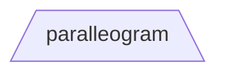
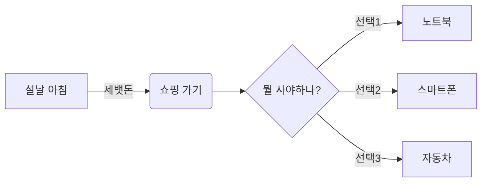
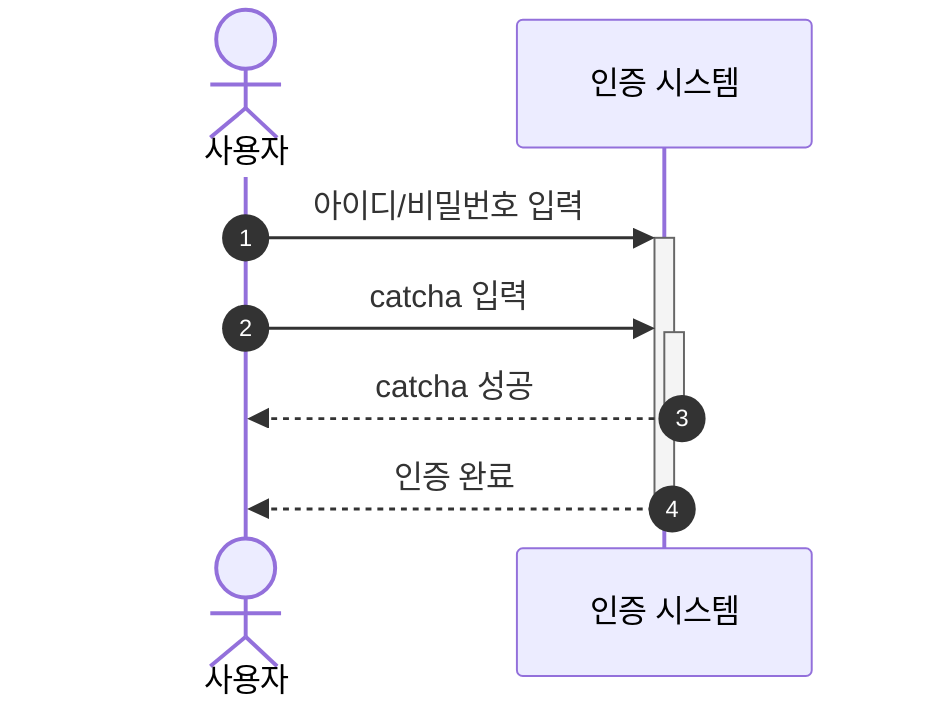

# Mermaid 실습 
- 순서도 실습
    - 첫번째 샘플


```mermaid
flowchart LR
    id1[/paralleogram\]
```


```mermaid
flowchart LR
    A[설날 아침] -->|세뱃돈| B(쇼핑 가기)
    B --> C{뭘 사야하나?}
    C -->|선택1| D[노트북]
    C -->|선택2| E[스마트폰]
    C -->|선택3| F[자동차] 
```


```mermaid
sequenceDiagram
    autonumber
    actor A as 사용자
    participant B as 인증 시스템
    A ->>+ B: 아이디/비밀번호 입력
    A ->>+ B: catcha 입력
    B -->>- A: catcha 성공
    B -->>- A: 인증 완료
```


```python
print("hello wold")
```
## 여기는 수업 끝 입니다.