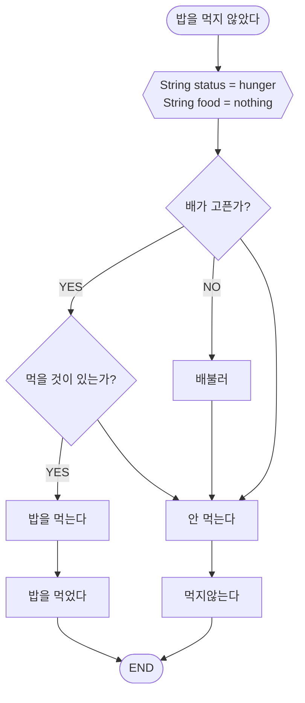

# 01 실습

```mermaid
flowchart TB
    a([밥을 먹지 않았다]) 
    b{{String status = hunger\nString food = nothing}} 
    c{배가 고픈가?} 
    d{먹을 것이 있는가?}
    e[밥을 먹는다]
    f[밥을 먹었다]
    g([END])
    h[안 먹는다]
    i[먹지않는다]
    aa[배불러]

    a --> b
    b --> c
    c -->|YES| d
    d -->|YES| e
    e --> f
    f --> g

    c -->|NO| aa --> h
    c --> h
    d --> h
    h --> i
    i --> g

```