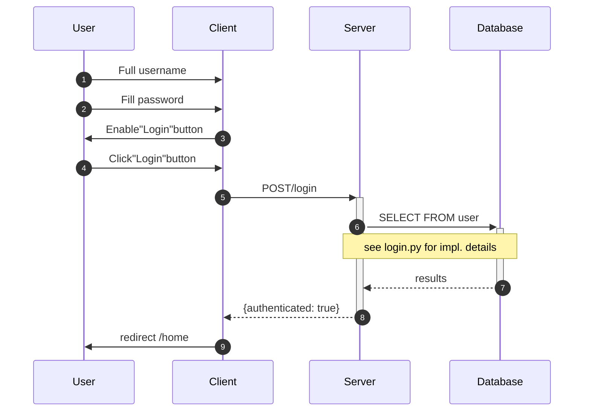

```mermaid
sequenceDiagram
    autonumber
    participant U as User
    participant C as Client
    participant S as Server
    participant DB as Database

    U ->> C: Full username
    U ->> C: Fill password
    C ->> U: Enable"Login"button
    U ->> C: Click"Login"button

    C ->>+ S: POST/login
        S ->>+ DB: SELECT FROM user
        Note over S, DB: see login.py for impl. details
        DB -->>- S: results
    S -->>- C: {authenticated: true}

    C ->> U: redirect /home
    

```