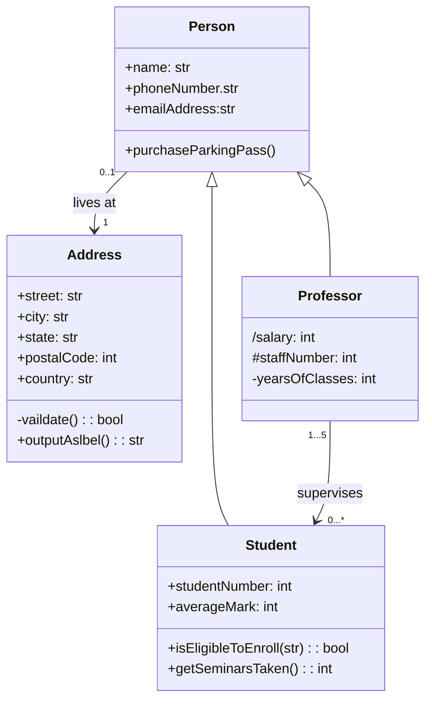

```mermaid
classDiagram 
    class Person {
        +name: str
        +phoneNumber.str
        +emailAddress:str
        +purchaseParkingPass()
    }
    class Address{
        +street: str
        +city: str
        +state: str
        +postalCode: int
        +country: str
        -vaildate(): bool
        +outputAslbel(): str
    }
    class Student{
        +studentNumber: int
        +averageMark: int
        +isEligibleToEnroll(str): bool
        +getSeminarsTaken(): int
    }
    class Professor{
        /salary: int
        #staffNumber: int
        -yearsOfClasses: int
    }
    Person <|-- Student
    Person <|-- Professor

    Person "0..1" --> "1" Address: lives at
    Professor "1...5" --> "0...*" Student: supervises
    


```